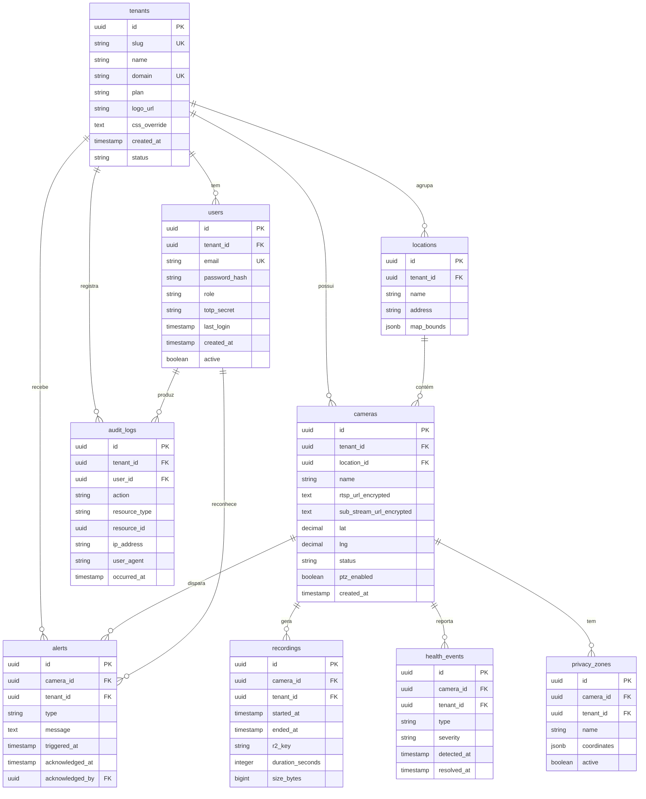

<!-- Meta
Versão: v0.1.0
Última atualização: 2026-06-04
Documentos relacionados:
  - [Multi-Tenancy](./MULTI_TENANCY.md)
  - [Security LGPD](./SECURITY_LGPD.md)
  - [API Contracts](./API_CONTRACTS.md)
  - [Arquitetura](./ARCHITECTURE.md)
-->

# Modelo de Dados {#data-model}

## 1. Diagrama ERD {#erd}



---

## 2. Entidades Detalhadas {#entidades}

### 2.1 tenants {#tenants}

Entidade raiz do modelo multi-tenant. Todo dado isolado pertence a um tenant.

| Coluna | Tipo | Nullable | Descrição | Índice |
|---|---|---|---|---|
| `id` | UUID | NOT NULL | PK gerado com `gen_random_uuid()` | PRIMARY KEY |
| `slug` | VARCHAR(100) | NOT NULL | Identificador único URL-friendly (ex: "seguranca-abc") | UNIQUE |
| `name` | VARCHAR(255) | NOT NULL | Nome da empresa do revendedor | — |
| `domain` | VARCHAR(255) | NULL | Domínio customizado para white-label (ex: "monitor.cliente.com.br") | UNIQUE |
| `plan` | VARCHAR(50) | NOT NULL | Enum: FREE, STARTER, PRO, ENTERPRISE | INDEX |
| `logo_url` | TEXT | NULL | URL da logo no R2 (path relativo) | — |
| `css_override` | TEXT | NULL | CSS customizado injetado no frontend para white-label | — |
| `created_at` | TIMESTAMPTZ | NOT NULL | Data de criação | INDEX |
| `status` | VARCHAR(50) | NOT NULL | Enum: ACTIVE, SUSPENDED, CANCELLED | INDEX |

```sql
CREATE TABLE tenants (
    id UUID PRIMARY KEY DEFAULT gen_random_uuid(),
    slug VARCHAR(100) NOT NULL UNIQUE,
    name VARCHAR(255) NOT NULL,
    domain VARCHAR(255) UNIQUE,
    plan VARCHAR(50) NOT NULL DEFAULT 'FREE',
    logo_url TEXT,
    css_override TEXT,
    created_at TIMESTAMPTZ NOT NULL DEFAULT NOW(),
    status VARCHAR(50) NOT NULL DEFAULT 'ACTIVE'
);
```

---

### 2.2 users {#users}

Usuários de todos os tenants. Isolados por RLS via `tenant_id`.

| Coluna | Tipo | Nullable | Descrição | Índice |
|---|---|---|---|---|
| `id` | UUID | NOT NULL | PK | PRIMARY KEY |
| `tenant_id` | UUID | NOT NULL | FK → tenants.id (RLS) | INDEX |
| `email` | VARCHAR(255) | NOT NULL | E-mail de login (único por tenant) | UNIQUE(tenant_id, email) |
| `password_hash` | VARCHAR(255) | NOT NULL | bcrypt hash da senha | — |
| `role` | VARCHAR(50) | NOT NULL | Enum: ADMIN, OPERATOR, VIEWER | INDEX |
| `totp_secret` | TEXT | NULL | Secret TOTP encriptado (AES-256) — NULL até 2FA ser configurado | — |
| `totp_enabled` | BOOLEAN | NOT NULL | Se 2FA está ativo para o usuário | — |
| `last_login` | TIMESTAMPTZ | NULL | Última autenticação bem-sucedida | — |
| `created_at` | TIMESTAMPTZ | NOT NULL | — | — |
| `active` | BOOLEAN | NOT NULL | Soft delete — desativar sem perder histórico | INDEX |

```sql
CREATE TABLE users (
    id UUID PRIMARY KEY DEFAULT gen_random_uuid(),
    tenant_id UUID NOT NULL REFERENCES tenants(id),
    email VARCHAR(255) NOT NULL,
    password_hash VARCHAR(255) NOT NULL,
    role VARCHAR(50) NOT NULL DEFAULT 'VIEWER',
    totp_secret TEXT,
    totp_enabled BOOLEAN NOT NULL DEFAULT FALSE,
    last_login TIMESTAMPTZ,
    created_at TIMESTAMPTZ NOT NULL DEFAULT NOW(),
    active BOOLEAN NOT NULL DEFAULT TRUE,
    UNIQUE(tenant_id, email)
);
```

---

### 2.3 cameras {#cameras}

Câmeras IP cadastradas. URLs RTSP criptografadas com AES-256 no banco.

| Coluna | Tipo | Nullable | Descrição | Índice |
|---|---|---|---|---|
| `id` | UUID | NOT NULL | PK | PRIMARY KEY |
| `tenant_id` | UUID | NOT NULL | FK → tenants.id (RLS) | INDEX |
| `location_id` | UUID | NULL | FK → locations.id | INDEX |
| `name` | VARCHAR(255) | NOT NULL | Nome amigável (ex: "Portaria Norte") | — |
| `rtsp_url_encrypted` | TEXT | NOT NULL | URL RTSP do stream principal (AES-256) | — |
| `sub_stream_url_encrypted` | TEXT | NULL | URL RTSP do sub-stream (baixa res) (AES-256) | — |
| `lat` | DECIMAL(10,8) | NULL | Latitude GPS | — |
| `lng` | DECIMAL(11,8) | NULL | Longitude GPS | — |
| `status` | VARCHAR(50) | NOT NULL | Enum: ONLINE, OFFLINE, UNKNOWN | INDEX |
| `ptz_enabled` | BOOLEAN | NOT NULL | Se a câmera suporta controle PTZ | — |
| `created_at` | TIMESTAMPTZ | NOT NULL | — | INDEX |

```sql
CREATE TABLE cameras (
    id UUID PRIMARY KEY DEFAULT gen_random_uuid(),
    tenant_id UUID NOT NULL REFERENCES tenants(id),
    location_id UUID REFERENCES locations(id),
    name VARCHAR(255) NOT NULL,
    rtsp_url_encrypted TEXT NOT NULL,
    sub_stream_url_encrypted TEXT,
    lat DECIMAL(10,8),
    lng DECIMAL(11,8),
    status VARCHAR(50) NOT NULL DEFAULT 'UNKNOWN',
    ptz_enabled BOOLEAN NOT NULL DEFAULT FALSE,
    created_at TIMESTAMPTZ NOT NULL DEFAULT NOW()
);
```

---

### 2.4 locations {#locations}

Agrupamento geográfico de câmeras (ex: "Matriz Centro", "Filial Sul").

| Coluna | Tipo | Nullable | Descrição | Índice |
|---|---|---|---|---|
| `id` | UUID | NOT NULL | PK | PRIMARY KEY |
| `tenant_id` | UUID | NOT NULL | FK → tenants.id (RLS) | INDEX |
| `name` | VARCHAR(255) | NOT NULL | Nome do local (ex: "Condomínio Residencial XYZ") | — |
| `address` | TEXT | NULL | Endereço completo | — |
| `map_bounds` | JSONB | NULL | Bounds do mapa `{sw: [lat, lng], ne: [lat, lng]}` para centralizar view | — |

```sql
CREATE TABLE locations (
    id UUID PRIMARY KEY DEFAULT gen_random_uuid(),
    tenant_id UUID NOT NULL REFERENCES tenants(id),
    name VARCHAR(255) NOT NULL,
    address TEXT,
    map_bounds JSONB
);
```

---

### 2.5 recordings {#recordings}

Metadados de segmentos de gravação armazenados no Cloudflare R2.

| Coluna | Tipo | Nullable | Descrição | Índice |
|---|---|---|---|---|
| `id` | UUID | NOT NULL | PK | PRIMARY KEY |
| `camera_id` | UUID | NOT NULL | FK → cameras.id | INDEX |
| `tenant_id` | UUID | NOT NULL | FK → tenants.id (RLS) | INDEX |
| `started_at` | TIMESTAMPTZ | NOT NULL | Início do segmento | INDEX |
| `ended_at` | TIMESTAMPTZ | NULL | Fim do segmento (NULL se em andamento) | INDEX |
| `r2_key` | TEXT | NOT NULL | Caminho no R2: `{tenant_id}/{camera_id}/YYYY/MM/DD/HH/seg_{N}.ts` | — |
| `duration_seconds` | INTEGER | NULL | Duração calculada ao fechar segmento | — |
| `size_bytes` | BIGINT | NULL | Tamanho do arquivo | — |

```sql
CREATE TABLE recordings (
    id UUID PRIMARY KEY DEFAULT gen_random_uuid(),
    camera_id UUID NOT NULL REFERENCES cameras(id),
    tenant_id UUID NOT NULL REFERENCES tenants(id),
    started_at TIMESTAMPTZ NOT NULL,
    ended_at TIMESTAMPTZ,
    r2_key TEXT NOT NULL,
    duration_seconds INTEGER,
    size_bytes BIGINT
);

CREATE INDEX idx_recordings_camera_time ON recordings(camera_id, started_at DESC);
CREATE INDEX idx_recordings_tenant ON recordings(tenant_id, started_at DESC);
```

---

### 2.6 health_events {#health_events}

Eventos de saúde detectados pelo CHMS. Ver [ARCHITECTURE.md#fluxo-alerta](./ARCHITECTURE.md#fluxo-alerta).

| Coluna | Tipo | Nullable | Descrição | Índice |
|---|---|---|---|---|
| `id` | UUID | NOT NULL | PK | PRIMARY KEY |
| `camera_id` | UUID | NOT NULL | FK → cameras.id | INDEX |
| `tenant_id` | UUID | NOT NULL | FK → tenants.id (RLS) | INDEX |
| `type` | VARCHAR(50) | NOT NULL | Enum: OFFLINE, BACK_ONLINE, LOW_CONFIDENCE, STREAM_ERROR | INDEX |
| `severity` | VARCHAR(50) | NOT NULL | Enum: INFO, WARNING, CRITICAL | — |
| `detected_at` | TIMESTAMPTZ | NOT NULL | Quando o problema foi detectado | INDEX |
| `resolved_at` | TIMESTAMPTZ | NULL | Quando o problema foi resolvido (NULL se ainda ativo) | — |

```sql
CREATE TABLE health_events (
    id UUID PRIMARY KEY DEFAULT gen_random_uuid(),
    camera_id UUID NOT NULL REFERENCES cameras(id),
    tenant_id UUID NOT NULL REFERENCES tenants(id),
    type VARCHAR(50) NOT NULL,
    severity VARCHAR(50) NOT NULL DEFAULT 'WARNING',
    detected_at TIMESTAMPTZ NOT NULL DEFAULT NOW(),
    resolved_at TIMESTAMPTZ
);

CREATE INDEX idx_health_events_camera ON health_events(camera_id, detected_at DESC);
CREATE INDEX idx_health_events_active ON health_events(tenant_id, resolved_at) WHERE resolved_at IS NULL;
```

---

### 2.7 audit_logs {#audit_logs}

Log imutável de todas as ações de usuários. Ver [SECURITY_LGPD.md](./SECURITY_LGPD.md).

| Coluna | Tipo | Nullable | Descrição | Índice |
|---|---|---|---|---|
| `id` | UUID | NOT NULL | PK | PRIMARY KEY |
| `tenant_id` | UUID | NOT NULL | FK → tenants.id | INDEX |
| `user_id` | UUID | NOT NULL | FK → users.id | INDEX |
| `action` | VARCHAR(100) | NOT NULL | Ex: LOGIN, LOGOUT, VIEW_CAMERA, DOWNLOAD_RECORDING, PTZ_COMMAND | INDEX |
| `resource_type` | VARCHAR(50) | NULL | Ex: CAMERA, RECORDING, USER | — |
| `resource_id` | UUID | NULL | ID do recurso afetado | — |
| `ip_address` | INET | NOT NULL | IP do cliente | — |
| `user_agent` | TEXT | NULL | Browser/client do usuário | — |
| `occurred_at` | TIMESTAMPTZ | NOT NULL | Momento exato da ação | INDEX |
| `metadata` | JSONB | NULL | Dados adicionais (ex: qualidade do stream, duração da sessão) | — |

```sql
CREATE TABLE audit_logs (
    id UUID PRIMARY KEY DEFAULT gen_random_uuid(),
    tenant_id UUID NOT NULL REFERENCES tenants(id),
    user_id UUID NOT NULL REFERENCES users(id),
    action VARCHAR(100) NOT NULL,
    resource_type VARCHAR(50),
    resource_id UUID,
    ip_address INET NOT NULL,
    user_agent TEXT,
    occurred_at TIMESTAMPTZ NOT NULL DEFAULT NOW(),
    metadata JSONB
);

CREATE INDEX idx_audit_logs_tenant_time ON audit_logs(tenant_id, occurred_at DESC);
CREATE INDEX idx_audit_logs_user ON audit_logs(user_id, occurred_at DESC);

-- Trigger de imutabilidade (nenhum UPDATE ou DELETE permitido)
CREATE OR REPLACE FUNCTION prevent_audit_log_modification()
RETURNS TRIGGER AS $$
BEGIN
    RAISE EXCEPTION 'audit_logs são imutáveis — UPDATE e DELETE não são permitidos';
END;
$$ LANGUAGE plpgsql;

CREATE TRIGGER audit_logs_immutable
BEFORE UPDATE OR DELETE ON audit_logs
FOR EACH ROW EXECUTE FUNCTION prevent_audit_log_modification();
```

---

### 2.8 privacy_zones {#privacy_zones}

Zonas de mascaramento de privacidade aplicadas sobre o stream de vídeo.

| Coluna | Tipo | Nullable | Descrição | Índice |
|---|---|---|---|---|
| `id` | UUID | NOT NULL | PK | PRIMARY KEY |
| `camera_id` | UUID | NOT NULL | FK → cameras.id | INDEX |
| `tenant_id` | UUID | NOT NULL | FK → tenants.id (RLS) | — |
| `name` | VARCHAR(255) | NOT NULL | Ex: "Área Privativa Apto 12" | — |
| `coordinates` | JSONB | NOT NULL | Array de pontos do polígono: `[[x1,y1],[x2,y2],...]` em % do frame | — |
| `active` | BOOLEAN | NOT NULL | Se a zona está sendo aplicada atualmente | INDEX |

```sql
CREATE TABLE privacy_zones (
    id UUID PRIMARY KEY DEFAULT gen_random_uuid(),
    camera_id UUID NOT NULL REFERENCES cameras(id),
    tenant_id UUID NOT NULL REFERENCES tenants(id),
    name VARCHAR(255) NOT NULL,
    coordinates JSONB NOT NULL,
    active BOOLEAN NOT NULL DEFAULT TRUE
);
```

---

### 2.9 alerts {#alerts}

Alertas gerados por eventos de saúde, movimento ou outros gatilhos.

| Coluna | Tipo | Nullable | Descrição | Índice |
|---|---|---|---|---|
| `id` | UUID | NOT NULL | PK | PRIMARY KEY |
| `camera_id` | UUID | NOT NULL | FK → cameras.id | INDEX |
| `tenant_id` | UUID | NOT NULL | FK → tenants.id (RLS) | INDEX |
| `type` | VARCHAR(50) | NOT NULL | Enum: CAMERA_OFFLINE, CAMERA_ONLINE, MOTION_DETECTED, LOW_CONFIDENCE | INDEX |
| `message` | TEXT | NOT NULL | Mensagem descritiva do alerta | — |
| `triggered_at` | TIMESTAMPTZ | NOT NULL | Quando o alerta foi gerado | INDEX |
| `acknowledged_at` | TIMESTAMPTZ | NULL | Quando um operador reconheceu o alerta | — |
| `acknowledged_by` | UUID | NULL | FK → users.id — quem reconheceu | — |

```sql
CREATE TABLE alerts (
    id UUID PRIMARY KEY DEFAULT gen_random_uuid(),
    camera_id UUID NOT NULL REFERENCES cameras(id),
    tenant_id UUID NOT NULL REFERENCES tenants(id),
    type VARCHAR(50) NOT NULL,
    message TEXT NOT NULL,
    triggered_at TIMESTAMPTZ NOT NULL DEFAULT NOW(),
    acknowledged_at TIMESTAMPTZ,
    acknowledged_by UUID REFERENCES users(id)
);

CREATE INDEX idx_alerts_tenant_unack ON alerts(tenant_id, triggered_at DESC)
    WHERE acknowledged_at IS NULL;
```

---

## 3. Políticas RLS {#rls-policies}

Todas as tabelas com `tenant_id` têm RLS habilitado. O `tenant_id` é definido via variável de sessão pelo backend no início de cada request.

```sql
-- Configurar RLS em todas as tabelas de tenant
ALTER TABLE users ENABLE ROW LEVEL SECURITY;
ALTER TABLE cameras ENABLE ROW LEVEL SECURITY;
ALTER TABLE locations ENABLE ROW LEVEL SECURITY;
ALTER TABLE recordings ENABLE ROW LEVEL SECURITY;
ALTER TABLE health_events ENABLE ROW LEVEL SECURITY;
ALTER TABLE audit_logs ENABLE ROW LEVEL SECURITY;
ALTER TABLE privacy_zones ENABLE ROW LEVEL SECURITY;
ALTER TABLE alerts ENABLE ROW LEVEL SECURITY;

-- Exemplo de política para cameras
CREATE POLICY tenant_isolation ON cameras
    USING (tenant_id = current_setting('app.current_tenant_id')::UUID);

-- Backend define o tenant no início do request:
-- SET app.current_tenant_id = '<uuid-do-tenant>';
```

Ver implementação Spring: [MULTI_TENANCY.md](./MULTI_TENANCY.md).

---

## 4. Índices Recomendados {#indices}

```sql
-- Queries mais frequentes

-- Mosaico: listar câmeras do tenant com status
CREATE INDEX idx_cameras_tenant_status ON cameras(tenant_id, status);

-- Timeline: segmentos de gravação por câmera e intervalo de tempo
CREATE INDEX idx_recordings_camera_time ON recordings(camera_id, started_at DESC, ended_at);

-- Alertas não reconhecidos por tenant
CREATE INDEX idx_alerts_tenant_unack ON alerts(tenant_id, triggered_at DESC)
    WHERE acknowledged_at IS NULL;

-- Health events ativos (câmeras com problema agora)
CREATE INDEX idx_health_events_active ON health_events(tenant_id, camera_id)
    WHERE resolved_at IS NULL;

-- Audit logs com filtros comuns
CREATE INDEX idx_audit_logs_action ON audit_logs(tenant_id, action, occurred_at DESC);
```

---

## 5. Referências Cruzadas

- Políticas RLS detalhadas: [MULTI_TENANCY.md](./MULTI_TENANCY.md)
- Auditoria e LGPD: [SECURITY_LGPD.md](./SECURITY_LGPD.md)
- Endpoints que retornam estas entidades: [API_CONTRACTS.md](./API_CONTRACTS.md)
