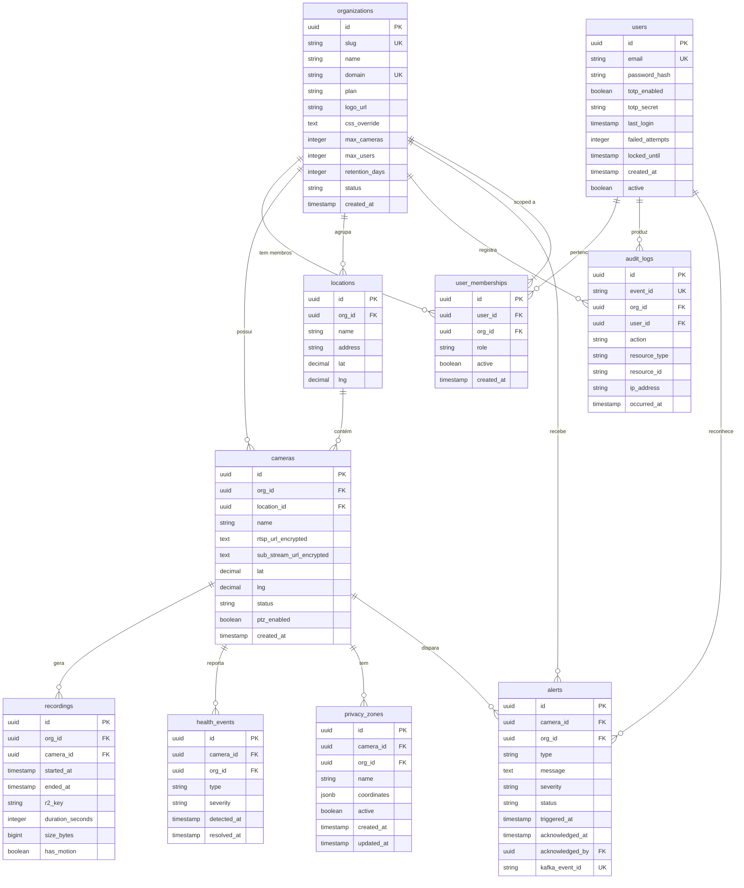

<!-- Meta
Versão: v0.2.0
Última atualização: 2026-06-21
Documentos relacionados:
  - [Multi-Tenancy](./MULTI_TENANCY.md)
  - [Security LGPD](./SECURITY_LGPD.md)
  - [API Contracts](./API_CONTRACTS.md)
  - [Arquitetura](./ARCHITECTURE.md)
-->

# Modelo de Dados {#data-model}

> **v0.2.0:** "tenant" renomeado para "organization" em todo o modelo. Relação user↔org agora é **N:M** via `user_memberships`. Coluna `tenant_id` → `org_id`. Schema `tenants` → `organizations`.

---

## 1. Diagrama ERD {#erd}



---

## 2. Entidades Detalhadas {#entidades}

### 2.1 organizations {#organizations}

Entidade raiz do modelo multi-org. Cada organização (empresa cliente) possui suas câmeras, usuários e dados.

| Coluna | Tipo | Nullable | Descrição | Índice |
|---|---|---|---|---|
| `id` | UUID | NOT NULL | PK | PRIMARY KEY |
| `slug` | VARCHAR(100) | NOT NULL | Identificador URL-friendly (ex: "seguranca-abc") | UNIQUE |
| `name` | VARCHAR(255) | NOT NULL | Nome da organização | — |
| `domain` | VARCHAR(255) | NULL | Domínio customizado white-label | UNIQUE |
| `plan` | VARCHAR(50) | NOT NULL | FREE, STARTER, PRO, ENTERPRISE | INDEX |
| `logo_url` | TEXT | NULL | URL da logo no R2 | — |
| `css_override` | TEXT | NULL | CSS customizado do frontend | — |
| `max_cameras` | INTEGER | NOT NULL | Limite de câmeras do plano | — |
| `max_users` | INTEGER | NOT NULL | Limite de usuários do plano | — |
| `retention_days` | INTEGER | NOT NULL | Dias de retenção de gravações | — |
| `status` | VARCHAR(50) | NOT NULL | ACTIVE, SUSPENDED, CANCELLED | INDEX |
| `created_at` | TIMESTAMPTZ | NOT NULL | — | — |

```sql
-- Schema: organizations.organizations
CREATE TABLE IF NOT EXISTS organizations.organizations (
    id              UUID         PRIMARY KEY DEFAULT gen_random_uuid(),
    slug            VARCHAR(100) NOT NULL UNIQUE,
    name            VARCHAR(255) NOT NULL,
    domain          VARCHAR(255) UNIQUE,
    plan            VARCHAR(50)  NOT NULL DEFAULT 'FREE',
    logo_url        TEXT,
    css_override    TEXT,
    max_cameras     INTEGER      NOT NULL DEFAULT 4,
    max_users       INTEGER      NOT NULL DEFAULT 2,
    retention_days  INTEGER      NOT NULL DEFAULT 7,
    status          VARCHAR(50)  NOT NULL DEFAULT 'ACTIVE',
    created_at      TIMESTAMPTZ  NOT NULL DEFAULT NOW(),
    updated_at      TIMESTAMPTZ  NOT NULL DEFAULT NOW()
);
```

---

### 2.2 users {#users}

Identidade global do usuário. **Sem** `org_id` ou `role` — esses pertencem à `user_memberships`.

| Coluna | Tipo | Nullable | Descrição | Índice |
|---|---|---|---|---|
| `id` | UUID | NOT NULL | PK | PRIMARY KEY |
| `email` | VARCHAR(255) | NOT NULL | E-mail globalmente único | UNIQUE |
| `password_hash` | VARCHAR(255) | NOT NULL | bcrypt (cost 12) | — |
| `totp_secret` | TEXT | NULL | Secret TOTP (AES-256) | — |
| `totp_enabled` | BOOLEAN | NOT NULL | Se 2FA está ativo | — |
| `last_login` | TIMESTAMPTZ | NULL | Última autenticação | — |
| `failed_attempts` | INTEGER | NOT NULL | Tentativas falhas consecutivas | — |
| `locked_until` | TIMESTAMPTZ | NULL | Bloqueio temporário (5 falhas = 15min) | — |
| `active` | BOOLEAN | NOT NULL | Soft delete global | INDEX |

```sql
-- Schema: auth.users
CREATE TABLE IF NOT EXISTS auth.users (
    id              UUID         PRIMARY KEY DEFAULT gen_random_uuid(),
    email           VARCHAR(255) NOT NULL UNIQUE,
    password_hash   VARCHAR(255) NOT NULL,
    totp_secret     TEXT,
    totp_enabled    BOOLEAN      NOT NULL DEFAULT FALSE,
    last_login      TIMESTAMPTZ,
    failed_attempts INTEGER      NOT NULL DEFAULT 0,
    locked_until    TIMESTAMPTZ,
    active          BOOLEAN      NOT NULL DEFAULT TRUE,
    created_at      TIMESTAMPTZ  NOT NULL DEFAULT NOW(),
    updated_at      TIMESTAMPTZ  NOT NULL DEFAULT NOW()
);
```

---

### 2.3 user_memberships {#user-memberships}

Tabela de junção N:M entre usuários e organizações. Um usuário pode ter roles diferentes em cada org.

| Coluna | Tipo | Nullable | Descrição | Índice |
|---|---|---|---|---|
| `id` | UUID | NOT NULL | PK | PRIMARY KEY |
| `user_id` | UUID | NOT NULL | FK → auth.users.id | INDEX |
| `org_id` | UUID | NOT NULL | Referência lógica a organizations.organizations | INDEX |
| `role` | VARCHAR(50) | NOT NULL | ADMIN, OPERATOR, VIEWER | — |
| `active` | BOOLEAN | NOT NULL | Desativa sem deletar (remove membro da org) | INDEX |
| `created_at` | TIMESTAMPTZ | NOT NULL | Data de entrada na org | — |

```sql
-- Schema: auth.user_memberships
CREATE TABLE IF NOT EXISTS auth.user_memberships (
    id         UUID        PRIMARY KEY DEFAULT gen_random_uuid(),
    user_id    UUID        NOT NULL REFERENCES auth.users(id) ON DELETE CASCADE,
    org_id     UUID        NOT NULL,
    role       VARCHAR(50) NOT NULL CHECK (role IN ('ADMIN', 'OPERATOR', 'VIEWER')),
    active     BOOLEAN     NOT NULL DEFAULT TRUE,
    created_at TIMESTAMPTZ NOT NULL DEFAULT NOW(),
    UNIQUE (user_id, org_id)
);
```

> **Nota de design:** Sem FK cross-schema para `organizations.organizations` — isolamento de schemas é mantido por design. A FK é enforçada pela aplicação.

---

### 2.4 cameras {#cameras}

Câmeras IP cadastradas. URLs RTSP criptografadas com AES-256-GCM.

| Coluna | Tipo | Nullable | Descrição | Índice |
|---|---|---|---|---|
| `id` | UUID | NOT NULL | PK | PRIMARY KEY |
| `org_id` | UUID | NOT NULL | FK → organizations.id (RLS) | INDEX |
| `location_id` | UUID | NULL | FK → locations.id | INDEX |
| `name` | VARCHAR(255) | NOT NULL | Nome amigável | — |
| `rtsp_url_encrypted` | TEXT | NULL | URL RTSP (AES-256-GCM) | — |
| `status` | VARCHAR(50) | NOT NULL | ONLINE, OFFLINE, UNKNOWN | INDEX |
| `ptz_enabled` | BOOLEAN | NOT NULL | Suporte a PTZ | — |
| `stream_token` | TEXT | NULL | Token HMAC para auth MediaMTX (TTL 1h) | — |
| `lat` / `lng` | DECIMAL | NULL | Coordenadas GPS | — |

```sql
-- Schema: cameras.cameras
CREATE TABLE IF NOT EXISTS cameras.cameras (
    id                      UUID         PRIMARY KEY DEFAULT gen_random_uuid(),
    org_id                  UUID         NOT NULL,
    location_id             UUID         REFERENCES cameras.locations(id),
    name                    VARCHAR(255) NOT NULL,
    rtsp_url_encrypted      TEXT,
    sub_stream_url_encrypted TEXT,
    status                  VARCHAR(50)  NOT NULL DEFAULT 'UNKNOWN',
    ptz_enabled             BOOLEAN      NOT NULL DEFAULT false,
    stream_token            TEXT,
    stream_token_expires_at TIMESTAMPTZ,
    lat                     DECIMAL(10,7),
    lng                     DECIMAL(10,7),
    created_at              TIMESTAMPTZ  NOT NULL DEFAULT NOW(),
    updated_at              TIMESTAMPTZ  NOT NULL DEFAULT NOW()
);
```

---

### 2.5 locations {#locations}

Agrupamento geográfico de câmeras por local físico.

```sql
CREATE TABLE IF NOT EXISTS cameras.locations (
    id         UUID         PRIMARY KEY DEFAULT gen_random_uuid(),
    org_id     UUID         NOT NULL,
    name       VARCHAR(255) NOT NULL,
    address    TEXT,
    lat        DECIMAL(10,7),
    lng        DECIMAL(10,7),
    created_at TIMESTAMPTZ  NOT NULL DEFAULT NOW(),
    updated_at TIMESTAMPTZ  NOT NULL DEFAULT NOW()
);
```

---

### 2.6 recordings {#recordings}

Metadados de segmentos de gravação. Arquivo binário no Cloudflare R2 (dev: MinIO).

```sql
CREATE TABLE IF NOT EXISTS recordings.recordings (
    id               UUID        PRIMARY KEY DEFAULT gen_random_uuid(),
    org_id           UUID        NOT NULL,
    camera_id        UUID        NOT NULL,
    r2_key           TEXT        NOT NULL,
    started_at       TIMESTAMPTZ NOT NULL,
    ended_at         TIMESTAMPTZ,
    duration_seconds INTEGER,
    size_bytes       BIGINT,
    has_motion       BOOLEAN     NOT NULL DEFAULT false,
    created_at       TIMESTAMPTZ NOT NULL DEFAULT NOW()
);
```

---

### 2.7 health_events {#health_events}

Eventos de saúde detectados pelo CHMS (Camera Health Monitoring Service).

```sql
CREATE TABLE IF NOT EXISTS health.health_events (
    id          UUID        PRIMARY KEY DEFAULT gen_random_uuid(),
    camera_id   UUID        NOT NULL,
    org_id      UUID        NOT NULL,
    type        VARCHAR(50) NOT NULL,   -- WENT_OFFLINE, CAME_ONLINE, LOW_CONFIDENCE
    severity    VARCHAR(50) NOT NULL DEFAULT 'WARNING',
    detected_at TIMESTAMPTZ NOT NULL DEFAULT NOW(),
    resolved_at TIMESTAMPTZ,
    metadata    JSONB
);
```

---

### 2.8 audit_logs {#audit_logs}

Log imutável de ações dos usuários. Sem UPDATE/DELETE por design (ADR-010).

| Coluna | Tipo | Descrição |
|---|---|---|
| `event_id` | VARCHAR | ID único do evento Kafka (idempotência) |
| `org_id` | UUID | Organização do contexto |
| `user_id` | UUID | Quem realizou a ação |
| `action` | VARCHAR | Ex: USER_LOGIN, CAMERA_CREATED, ALERT_ACKNOWLEDGED |
| `resource_type` | VARCHAR | Ex: CAMERA, USER, ALERT |
| `resource_id` | VARCHAR | ID do recurso afetado |

```sql
CREATE TABLE IF NOT EXISTS audit.audit_logs (
    id            UUID         PRIMARY KEY DEFAULT gen_random_uuid(),
    event_id      VARCHAR(255) NOT NULL UNIQUE,
    org_id        UUID         NOT NULL,
    user_id       UUID,
    action        VARCHAR(100) NOT NULL,
    resource_type VARCHAR(100),
    resource_id   VARCHAR(255),
    ip_address    VARCHAR(45),
    occurred_at   TIMESTAMPTZ  NOT NULL DEFAULT NOW(),
    raw_payload   JSONB
);
```

---

### 2.9 privacy_zones {#privacy_zones}

Zonas de mascaramento de privacidade por câmera (coordenadas de polígonos no frame).

```sql
CREATE TABLE IF NOT EXISTS cameras.privacy_zones (
    id          UUID         PRIMARY KEY DEFAULT gen_random_uuid(),
    camera_id   UUID         NOT NULL REFERENCES cameras.cameras(id) ON DELETE CASCADE,
    org_id      UUID         NOT NULL,
    name        VARCHAR(255) NOT NULL,
    coordinates JSONB,
    active      BOOLEAN      NOT NULL DEFAULT true,
    created_at  TIMESTAMPTZ  NOT NULL DEFAULT NOW(),
    updated_at  TIMESTAMPTZ  NOT NULL DEFAULT NOW()
);
```

---

### 2.10 alerts {#alerts}

Alertas gerados por eventos de câmera. Idempotentes por `kafka_event_id`.

```sql
CREATE TABLE IF NOT EXISTS alerts.alerts (
    id              UUID         PRIMARY KEY DEFAULT gen_random_uuid(),
    camera_id       UUID         NOT NULL,
    org_id          UUID         NOT NULL,
    type            VARCHAR(100) NOT NULL,   -- CAMERA_OFFLINE, MOTION_DETECTED
    message         TEXT,
    severity        VARCHAR(50)  NOT NULL DEFAULT 'WARNING',
    status          VARCHAR(50)  NOT NULL DEFAULT 'TRIGGERED',
    triggered_at    TIMESTAMPTZ  NOT NULL DEFAULT NOW(),
    acknowledged_by UUID,
    acknowledged_at TIMESTAMPTZ,
    kafka_event_id  VARCHAR(255) UNIQUE
);
```

---

## 3. Políticas RLS {#rls}

Todas as tabelas com `org_id` têm RLS habilitado. O valor é injetado pelo `JwtAuthFilter` via `SET LOCAL app.current_org_id = '<uuid>'` antes de cada query.

```sql
-- Padrão para todas as tabelas com org_id
CREATE POLICY org_isolation ON <schema>.<table>
    AS PERMISSIVE FOR ALL
    USING (org_id = current_setting('app.current_org_id', TRUE)::UUID)
    WITH CHECK (org_id = current_setting('app.current_org_id', TRUE)::UUID);
```

> **Exceção:** `auth.users` e `auth.user_memberships` não têm RLS — o service user (`auth_service_user`) é owner das tabelas Flyway e já tem isolamento garantido pela aplicação.

---

## 4. Schemas por Serviço {#schemas}

| Schema | Serviço owner | Tabelas |
|---|---|---|
| `organizations` | organization-service | `organizations`, `outbox_events` |
| `auth` | auth-service | `users`, `user_memberships`, `refresh_tokens`, `outbox_events` |
| `cameras` | camera-service | `cameras`, `locations`, `privacy_zones`, `outbox_events` |
| `health` | chms-service | `camera_health_state`, `health_events`, `outbox_events` |
| `recordings` | recording-service | `recordings`, `outbox_events` |
| `alerts` | alert-service | `alerts`, `outbox_events` |
| `audit` | audit-service | `audit_logs` |
